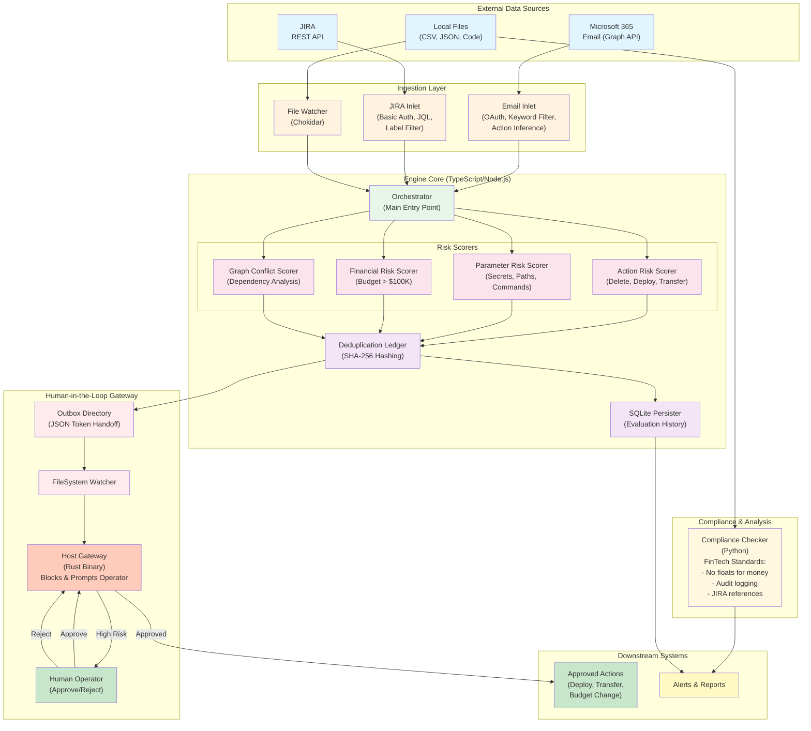

# Lucid PMO (NanoClaw) Architecture Diagram

## Architecture Layers Explained

### 1. **External Data Sources** (Top Layer)
- **M365 Email**: OAuth-authenticated Microsoft Graph API integration
- **JIRA**: Basic Auth REST API with JQL query support
- **Local Files**: CSV, JSON, and source code files

### 2. **Ingestion Layer** (Second Layer)
- **Email Inlet**: Filters by keywords, infers actions from email content
- **JIRA Inlet**: Executes JQL queries, filters by labels, supports CSV export
- **File Watcher**: Uses Chokidar for real-time file system monitoring

### 3. **Engine Core** (Third Layer - TypeScript/Node.js)
- **Orchestrator**: Main entry point coordinating all components
- **4 Risk Scorers**:
  - Action Risk: Detects dangerous operations (delete, deploy, transfer)
  - Parameter Risk: Identifies secrets, sensitive paths, commands
  - Financial Risk: Flags budget changes over $100K
  - Graph Conflict: Analyzes dependency conflicts
- **Deduplication Ledger**: SHA-256 hashing to prevent duplicate processing
- **SQLite Persister**: Stores evaluation history for audit trails

### 4. **Human-in-the-Loop Gateway** (Fourth Layer)
- **Outbox Directory**: JSON token handoff between engine and gateway
- **FileSystem Watcher**: Monitors outbox for new items
- **Rust Gateway**: High-performance binary that blocks high-risk actions
- **Human Operator**: Required approval for any high-risk action

### 5. **Compliance & Analysis** (Side Layer)
- **Python Compliance Checker**: Static analysis for FinTech standards
  - Enforces no floating-point for monetary values
  - Requires audit logging
  - Validates JIRA ticket references

### 6. **Downstream Systems** (Bottom Layer)
- **Approved Actions**: Only executed after human approval
- **Alerts & Reports**: Generated from evaluation history

## Key Design Principles

1. **No Autonomous High-Risk Execution**: All dangerous actions require human approval
2. **Polyglot Architecture**: Best tool for each job (TS for logic, Rust for performance, Python for analysis)
3. **Filesystem-Based Communication**: JSON tokens in outbox directory for inter-process communication
4. **Audit Trail**: SQLite persistence ensures all evaluations are recorded
5. **Deduplication**: Prevents processing the same item multiple times
6. **Real-Time Monitoring**: File watchers enable immediate response to new data
